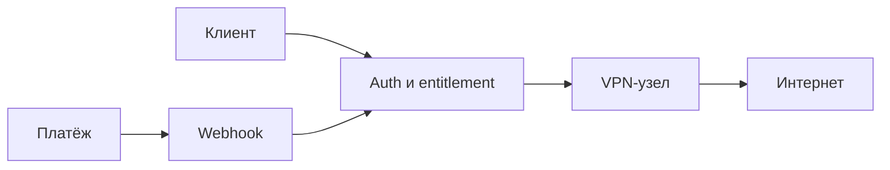
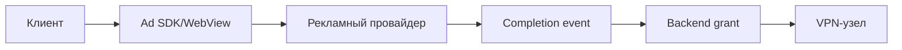
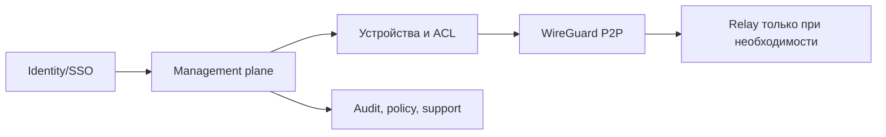
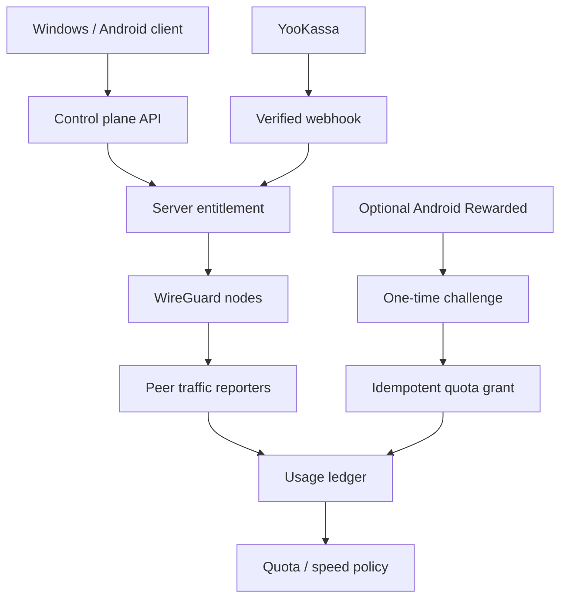

# Green VPN: исследование монетизации и публичной инфраструктуры VPN

Дата среза: 25.07.2026
Статус: исследование и рекомендация, без включения рекламы и без изменений production

## 1. Краткий вывод

Для Green VPN основной моделью должна стать **freemium-квота плюс платная
подписка**, а не обязательная реклама перед каждым подключением.

Рекомендуемая базовая схема:

- бесплатный тариф без рекламы: 3 ГБ в месяц, 1 устройство, автоматическая или
  ограниченная география, 5 Мбит/с;
- платный тариф: без рекламы, больше устройств и локаций, более высокий
  приоритет и справедливая квота;
- Rewarded-реклама на Android в будущем: только добровольное пополнение квоты,
  например `+250 МБ`, с дневным лимитом;
- Rewarded-реклама на Windows: оставить выключенной, пока провайдер письменно не
  разрешит Windows WebView2 и VPN-сценарий и не будет пройден физический
  paid-beta smoke;
- отдельное перспективное направление: управляемый приватный доступ для команд
  или white-label, где оплачиваются управление, устройства, роли, журналы и
  поддержка, а не рекламные показы.

На дату среза **ни один рекламный провайдер не готов для безопасного Windows
paid-beta**. Реальных значений eCPM и fill для нашей географии также нет.

Реклама в Green VPN сейчас должна оставаться выключенной.

## 2. Границы и метод исследования

Исследовано 44 продукта из разных классов:

- мобильные рекламные VPN;
- кроссплатформенные freemium VPN;
- полностью платные privacy VPN;
- браузерные VPN;
- самостоятельные и open-source решения;
- mesh VPN и корпоративные control plane;
- игровые маршрутизаторы;
- модели с передачей пользовательских ресурсов третьим лицам.

Источники, в порядке доверия:

1. официальные страницы тарифов, справка и техническая документация;
2. публичные описания серверов, протоколов и приложений;
3. страницы Google Play и реальные первые экраны приложений на физическом
   Android-устройстве;
4. ответы рекламных провайдеров и авторизованный кабинет партнёра;
5. выводы из публично наблюдаемой модели, явно помеченные как выводы.

Ограничения исследования:

- невозможно законно получить «полную внутреннюю инфраструктуру» закрытых
  коммерческих VPN: топология, контракты с дата-центрами, антифрод и экономика
  являются коммерческой тайной;
- поэтому ниже собрана **публично подтверждаемая инфраструктура**, а неизвестное
  не заполняется догадками;
- приложения не подключались к VPN, чтобы не менять маршруты и сеть Windows или
  телефона;
- не запускались пробные периоды, не оформлялись подписки, не принимались
  договоры и не вводились платёжные или персональные данные;
- desktop-клиенты с сетевыми драйверами не устанавливались: для модели
  монетизации это не добавляло бы достоверности, но меняло бы сеть компьютера;
- цены, бесплатные лимиты и география могут меняться после даты среза.

## 3. Что уже есть в Green VPN

### 3.1. Подтверждённые сильные стороны

- Windows- и Android-клиенты, веб-поверхность и серверный control plane.
- Серверные права на бесплатные и платные локации.
- YooKassa и уже проверенный путь реального платежа с выдачей доступа.
- Серверный учёт трафика по WireGuard peer:
  `apply_peer_traffic_report`, обработка baseline/reset и запись использования.
- Расчёт статуса квоты и `overLimit`.
- План ограничений скорости на peer через `tc`, включая отдельный профиль
  бесплатного пользователя.
- Challenge/idempotency для рекламного grant: сервер, а не клиент, решает,
  выдавать ли доступ.
- Реальный Android Rewarded SDK-путь ранее проходил физический smoke.
- Реклама отделена флагами и может быть выключена без изменения VPN-маршрутов.

### 3.2. Неподтверждённые или незавершённые части

- Нет доказательства, что `tc`-ограничение применено и проверено на каждом
  production VPN-узле; документация сохраняет dry-run-first модель.
- Нет подтверждённого Windows Rewarded-провайдера.
- Нет реального Windows placement и успешного provider callback smoke.
- Нет подписанного S2S-подтверждения просмотра от РСЯ: публичный API описывает
  клиентский `onRewarded(isRewarded)`.
- Нет подтверждённых eCPM/fill именно для RU/Europe аудитории Green VPN.
- Нет доказанной когортной экономики: конверсия free-to-paid, стоимость
  поддержки, нагрузка бесплатного трафика и отток пока не измерены в масштабе.

### 3.3. Текущее безопасное состояние

- `GREENVPN_FREE_AD_GATE_ENABLED=0`;
- platform allowlist пуст;
- Rewarded/test web выключены;
- таймер подключения выключен;
- production не содержит активного Windows-рекламного placement.

Это состояние нельзя менять в рамках исследования.

## 4. Что показала физическая проверка мобильных приложений

Проверка проводилась на физическом Samsung Android 9 из российского Google Play.
Ни одно VPN-соединение не запускалось.

| Приложение | Наблюдаемый первый путь | Что это показывает |
|---|---|---|
| Proton VPN | Вход или «Продолжить как гость», без немедленного рекламного экрана | Бесплатный тариф используется как доверительный вход в платную экосистему |
| Hotspot Shield | После privacy-экрана жёсткий trial paywall: 7 дней бесплатно, затем 5 990 ₽/год или 790 ₽/месяц; видимого free/skip не найдено | В конкретной RU-когорте продукт фактически приоритизирует подписку, а не рекламу |
| Turbo VPN | До главного экрана требуется принять privacy statement | Рекламный freemium сначала получает согласие и затем монетизирует ограниченный бесплатный путь |
| SuperVPN | До главного экрана просит разрешить фоновую работу/отключить оптимизацию батареи | Дешёвый бесплатный VPN создаёт дополнительное разрешительное и доверительное трение |
| Thunder VPN | Недоступен в российском Google Play | Рекламная модель зависит от региона, магазина и рекламного спроса и не даёт стабильной доступности |

Практический вывод: массовые мобильные ad-VPN обычно показывают interstitial на
старте, подключении или отключении и продают удаление рекламы. Это не тот же
механизм, что криптографически подтверждаемое «один завершённый Rewarded =
одно VPN-подключение». Популярные privacy VPN чаще субсидируют free-тариф из
подписок и не ставят рекламный callback в критический путь соединения.

### 4.1. Как зрелые VPN разделяют гостя, вход и оплату

Повторная проверка официальной документации 26.07.2026 показала общий
инвариант: восстановление уже купленного доступа не маскируют под новую оплату.

| Продукт | Подтверждённый сценарий | Решение для Green VPN |
|---|---|---|
| [Proton VPN](https://protonvpn.com/support/best-android-vpn-app) | На старте отдельно доступны `Sign in` и `Continue as guest`; premium появляется после входа в платный аккаунт | Гость остаётся основным первым путём, а вход в существующий аккаунт показывается отдельной кнопкой |
| [AdGuard VPN](https://adguard-vpn.com/kb/general/activate-subscription/) | Для активации уже купленной подписки пользователь нажимает `Log in or create an account` и входит с email покупки; подписка активируется автоматически | После email-кода клиент отдельно синхронизирует entitlement, не создавая новый заказ |
| [Mullvad](https://mullvad.net/uk/help/using-mullvad-vpn-app) | Первый экран разделяет `Create a new account` и `Log in with an existing account`; оплаченный срок виден в аккаунте | Идентичность и добавление оплаченного времени являются разными действиями |
| [TunnelBear](https://help.tunnelbear.com/hc/en-us/categories/360000518011-Getting-to-know-your-Bear) | Рядом с созданием бесплатного аккаунта есть отдельный `Log in with an Existing Account` | Вход не должен находиться только внутри кнопки покупки |
| [Windscribe](https://windscribe.com/knowledge-base/articles/can-i-use-windscribe-for-free) | Бесплатный аккаунт существует отдельно от Pro; подтверждённый email меняет лимит, а платный план является отдельным upgrade | Email можно использовать как идентификатор и стимул, но не как скрытый шаг повторной оплаты |

Целевой UX Green VPN:

1. чистая установка автоматически открывает бесплатный гостевой профиль;
2. на главном экране, в тарифе и в настройках виден отдельный вход по email;
3. вход проверяет и восстанавливает подписку, не вызывает YooKassa;
4. `Оплатить` создаёт заказ только для пользователя, который явно выбрал новую
   покупку;
5. просроченная гостевая сессия обновляется автоматически, а просроченная
   аккаунтная сессия открывает самостоятельный экран входа.

## 5. Карта исследованных VPN

### 5.1. Кроссплатформенный freemium

| Продукт | Платформы | Монетизация и free-ограничение | Публичная инфраструктура | Урок для Green VPN |
|---|---|---|---|---|
| [Proton VPN](https://protonvpn.com/free-vpn) | Windows, macOS, Linux, Android, iOS, расширения | Бесплатно без рекламы и лимита данных, 1 соединение и ограниченный автоматический выбор; платные планы и экосистема Proton | Собственные приложения, WireGuard/OpenVPN/Stealth, публичные сведения о Secure Core и аудитах | Сильный free-продукт может быть воронкой доверия, если платный тариф субсидирует инфраструктуру |
| [Windscribe](https://windscribe.com/knowledge-base/articles/how-much-does-it-cost-to-use-windscribe/) | Desktop, mobile, browser, router | 2 ГБ без email, 10 ГБ с подтверждением; Pro и Build-a-Plan | WireGuard/OpenVPN/IKEv2, приложения и расширения, собственный control plane | Квота и ограниченная география понятнее обязательной рекламы |
| [TunnelBear](https://www.tunnelbear.com/pricing/) | Windows, macOS, Android, iOS, browser | 2 ГБ/месяц; платный unlimited | WireGuard/OpenVPN/IKEv2 в зависимости от платформы, публичные аудиты | Один и тот же базовый UX, а лимит данных создаёт естественный upgrade |
| [PrivadoVPN](https://privadovpn.com/freevpn/) | Windows, macOS, Android, iOS, Fire TV | 10 ГБ быстрого трафика, ограниченные локации; подписка | WireGuard/OpenVPN/IKEv2, приложения и серверная сеть | Щедрая, но конечная квота подходит для первого опыта и измерения спроса |
| [hide.me](https://hide.me/en/pricing) | Windows, macOS, Linux, Android, iOS, browser, router | На текущей странице free без лимита данных, но с ограниченной скоростью, 8 локациями и 1 соединением; без рекламы | WireGuard/OpenVPN/IKEv2/SSTP/SoftEther | Ограничение скорости и географии может заменить рекламный gate |
| [AdGuard VPN](https://adguard-vpn.com/kb/general/free-vs-unlimited/) | Windows, macOS, Android, iOS, browser | 3 ГБ/месяц, 20 Мбит/с, 4 локации, 2 устройства; платный unlimited/10 устройств | Собственный протокол, приложения и расширения; кросс-продажа из экосистемы AdGuard | Практически прямой ориентир для стартового тарифа Green VPN |
| [Kaspersky VPN](https://support.kaspersky.com/KSDE/Win5.21/en-US/150117.htm) | Windows, macOS, Android, iOS | Регионально-зависимый малый дневной лимит; unlimited в подписке/пакете | Приложения внутри security-экосистемы, серверная сеть партнёров/провайдера | VPN может быть дополнением к более крупному security-продукту |
| [Avira Phantom VPN](https://www.avira.com/en/free-vpn) | Windows, macOS, Android, iOS | 500 МБ/месяц, больше после регистрации; Pro unlimited | Интеграция с Avira Security, приложения и серверная сеть | Малой квоты достаточно для демонстрации, но не для устойчивого ежедневного free-use |
| [Bitdefender VPN](https://www.bitdefender.com/content/dam/bitdefender/solutions/user-guide/vpn/bitdefender-vpn_user-guide-EN.pdf) | Windows, macOS, Android, iOS | 200 МБ/день/устройство и ближайший сервер; Premium unlimited | Часть security-suite, отдельное приложение, инфраструктурный партнёр | Cross-sell снижает требование окупать VPN самостоятельно |
| [Opera VPN](https://www.opera.com/features/free-vpn) | Desktop/Android внутри браузера | Бесплатный browser-only без учётной записи и лимита; VPN Pro охватывает устройство и несколько устройств | Proxy/VPN встроен в браузер; Pro использует системный клиент | Ограничение области трафика резко снижает себестоимость free |
| [Cloudflare WARP](https://developers.cloudflare.com/cloudflare-one/team-and-resources/devices/cloudflare-one-client/configure/route-traffic/client-architecture/) | Windows, macOS, Linux, Android, iOS | Бесплатный consumer WARP; платный WARP+/экосистема Zero Trust | Anycast-сеть Cloudflare, WireGuard/MASQUE, корпоративный control plane | Consumer free субсидируется крупной сетевой и B2B-платформой; это не сопоставимо с малым VPN по масштабу |

### 5.2. Privacy-first и полностью платные VPN

| Продукт | Платформы | Монетизация | Публичная инфраструктура | Урок |
|---|---|---|---|---|
| [Mullvad](https://mullvad.net/en/pricing) | Windows, macOS, Linux, Android, iOS | Плоские €5/месяц, без free и искусственных скидок | WireGuard/OpenVPN, [публичный список](https://mullvad.net/en/servers) owned/rented серверов, RAM-only, номер аккаунта вместо email | Простая цена и прозрачная инфраструктура сильнее сложных рекламных механик |
| [IVPN](https://www.ivpn.net/en/pricing/) | Windows, macOS, Linux, Android, iOS | Платные Standard/Pro, без массового free | Bare-metal, WireGuard/OpenVPN, open-source клиенты, multi-hop | Пользователь платит за доверие, аудит и минимизацию данных |
| [NordVPN](https://support.nordvpn.com/hc/en-us/articles/19564565879441-What-is-NordLynx) | Все основные ОС, browser, TV/router | Подписка, длительные планы, bundle security-продуктов | NordLynx поверх WireGuard, colocated/RAM-only серверы и собственные приложения | Маржа строится на масштабе, бренде, длинной предоплате и допродажах |
| [ExpressVPN](https://www.expressvpn.com/what-is-vpn/trustedserver) | Все основные ОС, router, TV | Премиальная подписка | Lightway, TrustedServer RAM-only, собственная router-линейка | Дорогой тариф оправдывается UX, скоростью, устройствами и проверяемой архитектурой |
| [Mozilla VPN](https://www.mozilla.org/en-US/products/vpn/resource-center/vpn-servers-around-the-world/) | Windows, macOS, Linux, Android, iOS | Платная подписка | WireGuard и инфраструктура Mullvad под брендом Mozilla | Реальный путь для white-label/инфраструктурного партнёрства вместо собственной глобальной сети |
| [Private Internet Access](https://www.privateinternetaccess.com/vpn-features) | Desktop, mobile, browser, router | Подписка, длинные планы, гарантия возврата | WireGuard/OpenVPN, open-source клиенты, RAM-only серверы | Unlimited devices и прозрачные клиенты являются продуктовыми differentiators |
| [CyberGhost](https://www.cyberghostvpn.com/vpn-free-trial) | Desktop, mobile, TV, browser | 24-часовой desktop trial, мобильные trial, затем подписка | WireGuard/OpenVPN/IKEv2, специализированные streaming/gaming серверы | Trial может заменить постоянный убыточный free-тариф |
| [Surfshark](https://surfshark.com/features) | Все основные ОС, browser, TV/router | Подписка и bundle с identity/security | WireGuard, RAM-only сеть, Nexus, unlimited devices | Платят не только за туннель, но и за пакет защиты и удобство семьи |

### 5.3. Рекламные и ad-plus-subscription VPN

| Продукт | Платформы | Монетизация | Публично видимая инфраструктура | Риск/урок |
|---|---|---|---|---|
| [Hotspot Shield](https://www.hotspotshield.com/) | Windows, macOS, Android, iOS, browser | Free/ограниченный или trial в зависимости от региона; Premium | Собственный Hydra-протокол и крупная серверная сеть | Реальный RU Android-путь показал hard paywall, поэтому публичное обещание free не гарантирует одинаковый продукт по когортам |
| [Betternet](https://support.betternet.co/hc/en-us/articles/360022424152-What-are-the-differences-between-the-Free-vs-the-Premium) | Windows, macOS, Android, iOS, browser | Basic с рекламой и 500 МБ/день; Premium без рекламы | Связана с инфраструктурой Aura/Hotspot Shield | Реклама является добавкой к квоте, а не доказательством завершённого Rewarded |
| [Turbo VPN](https://support.turbovpn.com/hc/en-sg/articles/39918850235929-How-much-does-Turbo-VPN-premium-cost) | Windows, macOS, Android, iOS, browser | Free с рекламой/ограничениями; Premium | Проприетарная серверная сеть, подробная ownership-карта ограничена | Высокая доступность оплачивается рекламным трением и меньшей прозрачностью |
| [VPN Proxy Master](https://www.vpnproxymaster.com/) | Windows, macOS, Android, iOS, browser | Free с рекламой и Premium | Проприетарная сеть; мало публичных деталей о владении узлами | Не использовать непрозрачность как образец только из-за большого числа установок |
| [X-VPN](https://xvpn.io/free-vpn) | Windows, macOS, Linux, Android, iOS, browser, TV | Desktop free заявлен без рекламы; mobile может содержать optional ads; Premium | Собственные приложения и проприетарный протокол, limited public topology | Показывает, что desktop и mobile можно монетизировать по-разному |
| [SuperVPN](https://play.google.com/store/apps/details?id=com.jrzheng.supervpnfree) | Android | Реклама и VIP/in-app purchase | Публичная карта серверов и ownership ограничены | Запрос фоновой работы до ценности ухудшает доверие; не повторять |
| Thunder VPN | Android | Реклама и in-app purchase | Проприетарная сеть, ограниченная прозрачность | Недоступность в RU Play подтверждает региональную хрупкость ad-модели |
| [Psiphon](https://psiphon.ca/) | Windows, Android, iOS | Реклама, подписка/PsiCash и пожертвования в разных клиентах | Open-source circumvention client, собственная распределённая сеть и transport obfuscation | Обход блокировок, гранты и миссия создают экономику, которой нет у обычного коммерческого VPN |
| [Lantern](https://lantern.io/) | Windows, macOS, Linux, Android, iOS | Бесплатный лимит/ограничение, Pro; грантовая поддержка | P2P/relay и прокси-инфраструктура для circumvention | Гранты и социальная миссия нельзя переносить в unit-экономику Green VPN |
| [Urban VPN](https://www.urban-vpn.com/) | Windows, macOS, Android, iOS, browser | Free и Premium | Публичная прозрачность маршрутизации и ownership ограничена | «Бесплатно без понятной экономики» должно считаться риском, а не преимуществом |
| [Browsec](https://browsec.com/en/pricing) | Browser, Android, iOS | Free с малой скоростью/локациями, Premium | Browser proxy плюс мобильные клиенты, проприетарная сеть | Ограничение скорости/географии проще и надёжнее Rewarded gate |
| [VeePN](https://veepn.com/) | Desktop, mobile, browser | Бесплатное расширение, trial/платные приложения | Расширение и системные клиенты, WireGuard/OpenVPN/IKEv2 | Бесплатный browser funnel дешевле полного системного free VPN |

### 5.4. Self-hosted, open-source и donation

| Продукт | Платформы | Кто платит | Публичная инфраструктура | Урок |
|---|---|---|---|---|
| [Amnezia VPN](https://amnezia.org/) | Windows, macOS, Linux, Android, iOS | Self-host: пользователь платит за VPS; есть Premium и Business | Open-source клиент разворачивает WireGuard/OpenVPN/Cloak/AmneziaWG на VPS; free selective routing снижает нагрузку | Пользователь может владеть сервером; selective tunnel является честным способом уменьшить free-себестоимость |
| [Outline](https://getoutline.org/faq/) | Manager desktop, server cloud, clients desktop/mobile | Оператор оплачивает VPS и выдаёт access keys | Open-source Outline Manager/Server/Client, Shadowsocks, квоты на ключ | Отделение управляющего приложения, сервера и access key полезно для white-label/B2B |
| [SoftEther / VPN Gate](https://www.vpngate.net/en/about_us.aspx) | Windows/Linux server, основные client protocols | Академический проект и добровольные relay | Open-source SoftEther, публичные volunteer relay | Volunteer-сеть не подходит коммерческому продукту с SLA и ответственностью |
| [RiseupVPN](https://we.riseup.net/riseuphelp%2Ben/vpn-donate) | Desktop, Android, Linux | Пожертвования | LEAP/open-source клиент и инфраструктура некоммерческой организации | Donation работает при сильной миссии и сообществе, а не как универсальная модель |

### 5.5. Mesh VPN и корпоративный control plane

| Продукт | Платформы | Монетизация | Публичная инфраструктура | Урок |
|---|---|---|---|---|
| [Radmin VPN](https://www.radmin-vpn.com/) | Только Windows | Полностью бесплатно; cross-sell коммерческого Radmin | P2P virtual LAN, центральная координация | Бесплатный VPN может быть воронкой другого прибыльного продукта |
| [Hamachi](https://vpn.net/?lang=en) | Windows, macOS, Linux | Free до 5 компьютеров, платные сети по размеру | Hosted control plane, mesh/hub-and-spoke/gateway режимы | Монетизируется размер частной сети, а не публичный egress |
| [Tailscale](https://tailscale.com/pricing) | Все основные ОС, NAS, containers | Personal free; Standard/Premium по пользователям; платный Mullvad exit-node add-on | WireGuard P2P, coordination server, DERP relay, ACL/identity | Высокомаржинальны identity, ACL, device management, audit и support |
| [ZeroTier](https://www.zerotier.com/pricing/) | Desktop, mobile, NAS/IoT | Free по малому числу устройств, затем подписка/устройство | P2P overlay, roots/moons/controller, self-host options | Хорошая единица тарификации: управляемое устройство |
| [NetBird](https://docs.netbird.io/about-netbird/how-netbird-works) | Desktop, mobile, Linux/server | Free small team; Team/Business по пользователям; self-host | WireGuard P2P, Management, Signal и Relay services | Green VPN может позже продавать private access для команд поверх существующего control plane |

Mesh VPN не является прямым конкурентом consumer privacy VPN: по умолчанию он
соединяет устройства пользователя и не оплачивает массовый публичный egress.
Именно поэтому его бесплатный тариф может быть намного щедрее.

### 5.6. Игровая маршрутизация

| Продукт | Платформы | Монетизация | Публичная инфраструктура | Урок |
|---|---|---|---|---|
| [ExitLag](https://www.exitlag.com/knowledgebase/105/iComo-funciona-mi-prueba-gratuita.html) | Windows и mobile | Короткий trial, затем подписка | Multi-path/game-route optimization через региональные узлы | Продаётся измеримый outcome: latency/jitter для конкретных игр |
| [WTFast](https://www.wtfast.com/) | Прежде всего Windows | Trial и подписка | GPN с игровыми relay и выбором маршрута | Узкий use case позволяет брать плату без обещания универсальной приватности |
| [Mudfish](https://docs.mudfish.net/en/docs/mudfish-policy/data-plan/) | Windows, macOS, Linux, Android/router | Pay-per-traffic или дешёвая ограниченная подписка | Много relay-узлов; тарификация учитывает трафик через узел в обе стороны | Микроплатёж за измеримый сетевой ресурс возможен, но требует прозрачного счётчика |

### 5.7. Модель, которую нельзя использовать

| Продукт | Модель | Почему отвергается |
|---|---|---|
| [Hola](https://hola.org/faq) | Бесплатные пользователи могут участвовать ресурсами устройства/сети; business-сервис монетизирует routing, premium выходит из этой модели | Green VPN не должен превращать устройства и IP пользователей в residential proxy, продавать их трафик или скрывать такую роль |

## 6. Архитектурные модели рынка

### 6.1. Подписочный privacy VPN



Доход предсказуем, пользователь не видит рекламу, а продукт конкурирует
скоростью, географией, доверием, аудитами и поддержкой.

### 6.2. Freemium с квотой


Это наиболее близко к уже существующей архитектуре Green VPN. Критические
свойства: серверный счётчик, fail-closed entitlement, понятный reset,
идемпотентность и единообразие всех узлов.

### 6.3. Рекламный VPN



Слабое место: если `Completion event` существует только в клиентском JavaScript,
его можно подделывать. Подписанный S2S callback предпочтителен. Реклама также
добавляет fill-риск: отсутствие объявления не должно лишать пользователя
базового обещанного сервиса.

### 6.4. Mesh/B2B



Здесь продаются управление и безопасность команды. Публичный интернет-трафик
обычно не проходит через сервис, поэтому валовая маржа структурно выше.

## 7. Статус рекламных провайдеров

Состояние на 25.07.2026:

| Провайдер | Windows WebView2/VPN | РФ publisher и вывод | Completion | Решение |
|---|---|---|---|---|
| РСЯ | Окончательного ответа нет. 23.07 поддержка повторно сообщила, что ещё выясняет засчитывание WebView2-трафика | Для самозанятого РФ заявлены RUB на счёт, YooMoney или СБП; порог 3 000 ₽ | Публично документирован клиентский `onRewarded`; подписанный S2S не найден | Первый условный кандидат, но Windows beta заблокирована ожиданием письменного ответа и модерацией площадки |
| MediaToday | Нет ответа | Не подтверждено | Не подтверждено | Не интегрировать |
| ayeT Studios | Только автоматическое подтверждение обращения | Не подтверждено | Не подтверждено | Не интегрировать |
| Monetag | Rewarded только для Telegram Mini Apps; обычный WebView2/native не поддерживается | Регистрация с РФ закрыта | S2S только в Telegram-сценарии | Исключён |
| AppLixir | Технический сценарий не подтверждён | Подходящего вывода в РФ нет | Не подтверждено | Исключён; также требует минимум 100 000 показов/месяц |
| Adsterra | Документированного utility Rewarded нет; предложены web-коды/Smartlink | Точные доступные методы и экономика не подтверждены | VAST не поддерживается | Исключён: incentivized traffic прямо запрещён |

Дополнительные факты по РСЯ:

- отклонённую площадку нельзя повторно подать раньше 18.08.2026;
- причина отклонения относилась к качеству/содержанию сайта, дизайну, метрикам и
  рабочим разделам, а не была сформулирована как общий запрет VPN;
- [правила Rewarded](https://yandex.ru/support/partner/ru/web/units/types/rewarded)
  требуют явного согласия пользователя и реального вознаграждения;
- desktop и mobile site используют отдельные блоки;
- включение формата требует поддержки;
- клиентский callback сам по себе не является сильным антифрод-доказательством.

Итог: на дату среза placement для Windows добавлять нельзя.

## 8. Экономика

### 8.1. Что известно

- Нижняя документированная стоимость инфраструктуры в одном из периодов:
  около 7 908 ₽/месяц без SMS, комиссий, домена и части переменных расходов.
- Для планирования в проекте фигурируют диапазоны 10–12 тыс. ₽ и
  12–18 тыс. ₽, а backend-модель использует 16 тыс. ₽ fixed cost.
- Для осторожного сравнения ниже используется диапазон **12–16 тыс. ₽/месяц**.
  Это плановая граница, а не утверждение о текущем счёте.
- Плановая доля выручки после платёжных/налоговых/прочих удержаний: 76%.
- Реальных eCPM/fill от кандидатов для Green VPN нет.

### 8.2. Рекламный сценарий

Формула:

```text
выручка free-пользователя в месяц =
запросы рекламы × fill × completion × eCPM / 1000
```

Сценарий для сравнения, не прогноз:

- 2 запроса в день = 60 в месяц;
- произведение fill и completion = 60%;
- eCPM: 50, 100 или 200 ₽.

| eCPM | Выручка с free MAU/месяц | MAU для 12 000 ₽ | MAU для 16 000 ₽ |
|---:|---:|---:|---:|
| 50 ₽ | 1,80 ₽ | 6 667 | 8 889 |
| 100 ₽ | 3,60 ₽ | 3 334 | 4 445 |
| 200 ₽ | 7,20 ₽ | 1 667 | 2 223 |

Это расчёт **до** переменной стоимости трафика, поддержки, возвратов,
антифрода и потерь пользователей из-за рекламы.

Если за один завершённый показ с eCPM 50–100 ₽ выдавать 250 МБ:

- доход за показ: 0,05–0,10 ₽;
- монетизация выданного гигабайта: всего 0,20–0,40 ₽;
- следовательно, Rewarded нельзя считать гарантированным способом оплачивать
  тяжёлый VPN-трафик без реальных данных о себестоимости и поведении когорты.

### 8.3. Подписочный сценарий

| Цена | Плановый вклад после коэффициента 76% | Платящих для 12 000 ₽ | Платящих для 16 000 ₽ |
|---:|---:|---:|---:|
| 249 ₽ | 189,24 ₽ | 64 | 85 |
| 299 ₽ | 227,24 ₽ | 53 | 71 |

Один платящий по 249 ₽ даёт примерно столько же планового вклада, сколько
**53 free-пользователя** в рекламном сценарии с eCPM 100 ₽.

Вывод: реклама может быть дополнительным доходом и acquisition-механикой, но
не должна быть основой unit-экономики Green VPN до появления тысяч активных
free-пользователей и измеренного fill.

## 9. Правовые и платёжные ограничения

Это продуктовая оценка, а не юридическое заключение.

- С 01.09.2025
  [российские государственные разъяснения](https://epp.genproc.gov.ru/ru/proc_78/activity/legal-education/explain/otherwise/e8255163/)
  указывают на запрет рекламы VPN-сервисов. До публичного продвижения нужен
  письменный вывод российского специалиста по рекламе, связи и
  интернет-регулированию.
- [Статья 13.52 КоАП РФ](https://www.consultant.ru/document/cons_doc_LAW_34661/eabd9fa2f3caeca1f1c8c620f95fd03af4447246/)
  предусматривает ответственность, связанную с обязанностями владельцев
  средств доступа к ограниченным ресурсам. Применимость к конкретной
  архитектуре Green VPN должен оценить юрист.
- Реклама сторонних товаров **внутри** VPN и реклама самого VPN являются
  разными вопросами, но обе требуют проверки рекламных материалов, consent,
  privacy и обработки идентификаторов.
- Нельзя маскировать назначение продукта или давать ложное описание площадки
  рекламной сети.
- Банковские реквизиты, паспортные данные, ИНН/СНИЛС, KYC, оферты и договоры
  нельзя автоматически вводить или принимать.
- Рекуррентные платежи требуют явного согласия, понятной периодичности и
  доступного отключения/удаления сохранённого способа оплаты согласно
  [документации YooKassa](https://yookassa.ru/developers/payment-acceptance/scenario-extensions/recurring-payments/basics).

## 10. Ранжирование моделей для Green VPN

| Место | Модель | Ожидаемый вклад | Риск | Решение |
|---:|---|---|---|---|
| 1 | Free-квота + подписка | Наиболее предсказуемый; десятки платящих полезнее тысяч слабомонетизируемых показов | Нужно доказать quota enforcement и конверсию | Делать основной моделью |
| 2 | Годовой/семейный план и дополнительные устройства | Повышает LTV без рекламного трения | Нужны понятные правила и поддержка | После стабильного месячного тарифа |
| 3 | B2B/private access/white-label | Потенциально высокая маржа control plane | Это отдельный продукт и продажи | Исследовать после consumer beta |
| 4 | Android Rewarded как optional top-up | Небольшой дополнительный доход и возврат free-user | Fill, антифрод, policy и consent | Только отдельный эксперимент |
| 5 | Прямой спонсор/affiliate | Может быть выше programmatic eCPM | Юридический, репутационный и disclosure-риск | Только после юрпроверки и без влияния на соединение |
| 6 | Windows WebView2 Rewarded | Пока неизвестен | Нет письменного разрешения и S2S | Оставить выключенным |
| 7 | Обязательная реклама на каждое подключение | Низкая ожидаемая выручка, высокий отток | No-fill блокирует основную ценность; spoofing callback | Отказаться как от основной модели |
| 8 | Продажа данных/IP/ресурсов пользователя | Может давать стороннюю выручку | Неприемлемый trust, security и legal риск | Никогда не использовать |

## 11. Целевой Product Contract

### Бесплатный тариф

- 3 ГБ трафика на календарный месяц.
- 1 устройство.
- Автоматическая локация или 1–2 бесплатные локации.
- 5 Мбит/с sustained, ограниченный burst.
- Без обязательной рекламы.
- Чёткий индикатор остатка и даты обновления.
- При исчерпании квоты: предсказуемая остановка нового соединения или
  заранее объявленный очень медленный режим. Конкретный вариант выбрать до
  реализации, не менять молча.
- No-fill или сбой рекламного SDK не отнимает базовую бесплатную квоту.

### Платный тариф

- 249 ₽ как понятная базовая цена либо 299 ₽ после подтверждённой ценности.
- Без рекламы.
- Больше устройств и локаций.
- Более высокий приоритет/скорость.
- Прозрачная fair-use квота, если безлимит ещё не доказан нагрузкой.
- Явное управление автопродлением и способом оплаты.

### Optional Rewarded на Android

- Только явная кнопка пользователя: «Посмотреть рекламу и получить 250 МБ».
- Никакого autoplay, скрытого показа, автоклика или рекламы после Connect.
- Grant только после provider completion.
- Backend challenge, короткий TTL, nonce и idempotency.
- Один completion создаёт один top-up; повтор callback не начисляет квоту.
- Дневной лимит, например 1–2 top-up, задаётся сервером.
- Доход, fill, completion, fraud и последующая нагрузка измеряются отдельно.
- Функция отключается одним server-side flag.

### Windows

- Базовая бесплатная квота работает без рекламы.
- Rewarded отсутствует до письменного разрешения WebView2/VPN.
- Даже после разрешения сначала только isolated paid-beta на обоих control
  plane, затем физический smoke владельцем.
- Production требует отдельного разрешения.

## 12. Рекомендуемая техническая архитектура



Обязательные инварианты:

- клиент никогда сам не назначает себе free/premium/rewarded entitlement;
- usage ledger монотонен с отдельной обработкой reset/rekey;
- один peer/device нельзя одновременно учитывать на двух пользователей;
- один payment/ad event применяется не более одного раза;
- потеря reporter не открывает безлимитный fail-open;
- политика одинакова на всех VPN-узлах;
- у каждого изменения есть server-side rollback.

## 13. План завершения монетизации

### Gate 0. Юридическая допустимость

- Получить письменное заключение по публичному продвижению VPN в РФ.
- Отдельно проверить показ сторонней рекламы внутри клиента, privacy/consent,
  трансграничную передачу идентификаторов и формулировки сайта.
- До заключения не запускать публичную рекламную кампанию Green VPN.

### Gate 1. Доказать себестоимость и enforcement

- Проверить, что traffic reporter работает на каждом VPN-узле.
- Снять baseline: активные peer, ГБ/user/day, peak Mbps, CPU, RAM, packet loss.
- Проверить `build_wg_peer_rate_limit_plan` в dry-run.
- На одном paid-beta peer применить `tc`, проверить текущий профиль 10 Мбит/с
  и rollback.
- Проверить reset/rekey/reconnect и смену узла.
- Не применять `--apply` массово без владельца и окна rollback.

Критерий выхода: лимит нельзя обойти обычным reconnect/reinstall, а rollback
возвращает прежнее состояние.

### Gate 2. Вертикальный срез free quota

- Сервер создаёт monthly allowance.
- Клиент показывает использовано/осталось/reset date.
- Новый connect при исчерпанной квоте следует выбранной политике.
- Платёж атомарно снимает free-ограничение.
- Android и Windows ведут себя одинаково.

Критерий выхода: физическая матрица двух платформ и двух control plane, включая
offline, no-capacity, expired entitlement и payment replay.

### Gate 3. Paid beta без рекламы

- Ограниченная когорта.
- Метрики: activation, connected minutes, ГБ, conversion, churn, support,
  capacity и реальный net revenue.
- Аварийные флаги для quota и speed policy.
- Production не менять до отдельного разрешения.

### Gate 4. Android Rewarded experiment

Запускается только если:

- есть письменное разрешение VPN/incentivized-сценария;
- площадка и блок одобрены;
- provider completion подтверждён;
- privacy/consent/ads.txt готовы;
- no-fill не блокирует free-тариф;
- paid-beta rollback проверен.

Сравнить когорты:

- free quota без рекламы;
- free quota плюс optional top-up;
- измерить не показы, а net contribution после дополнительного VPN-трафика.

### Gate 5. Windows Rewarded

Остаётся закрытым, пока одновременно не выполнены:

- письменное разрешение WebView2/VPN от провайдера;
- успешная модерация;
- реальный placement;
- документированный callback;
- anti-replay paid-beta;
- физический smoke владельцем;
- отдельное разрешение на production.

## 14. Что не делать в следующем цикле

- Не выбирать рекламную сеть по обещанному глобальному eCPM без RU fill.
- Не писать интеграцию до письменного подтверждения формата, платформы, VPN,
  incentivized traffic и вывода денег.
- Не считать клиентский таймер доказательством просмотра.
- Не ставить рекламу в критический путь базового соединения.
- Не обещать безлимит до замера capacity и применения server enforcement.
- Не использовать искусственные показы, клики, autoplay или hidden WebView.
- Не собирать KYC и не принимать оферту автоматически.
- Не включать production после HTTP smoke; нужен физический клиентский smoke.
- Не копировать ad-heavy VPN только потому, что у него много установок.
- Не продавать трафик, данные, IP или ресурсы устройства пользователя.

## 15. Решение на дату среза

1. Оставить всю рекламу выключенной.
2. Зафиксировать freemium quota + subscription как основную модель.
3. Следующая разработка: доказать traffic accounting и rate-limit rollback на
   всех узлах, затем сделать физический quota beta без рекламы.
4. РСЯ продолжать рассматривать только как optional Android top-up и возможный
   более поздний Windows-эксперимент.
5. MediaToday и ayeT не интегрировать без полного письменного ответа.
6. Monetag, AppLixir и Adsterra не возвращать в shortlist без изменения их
   правил/доступности.
7. После consumer beta отдельно оценить B2B/private access/white-label.

Так Green VPN получает монетизацию, которая зависит от десятков платящих
пользователей и измеряемой себестоимости, а не от тысяч непредсказуемых
рекламных показов.
